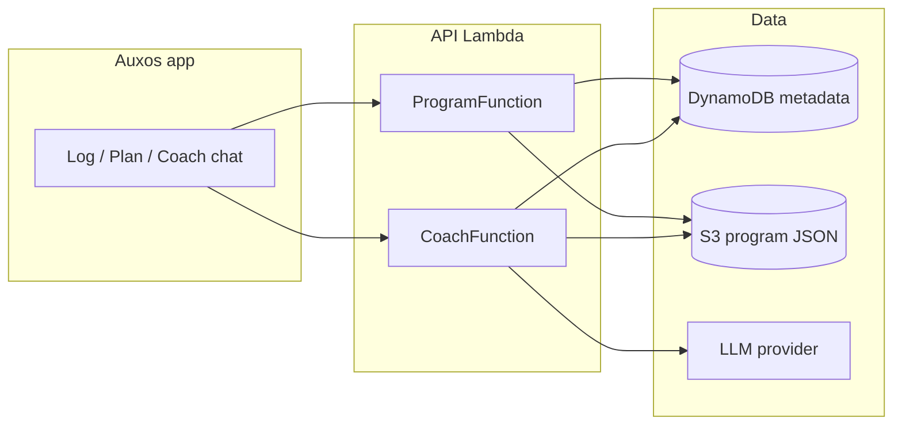

# AI Coach + program storage (target architecture)

## Short answer: yes, use S3 — with DynamoDB as the index

S3 is a strong fit for **program documents** (large JSON, versioning, cheap history). It is a weak fit as the **only** database: you still need DynamoDB (or similar) for who owns what, which version is active, and coach chat threads.

## Responsibilities

| Layer | Stores | Why |
|-------|--------|-----|
| **S3** | `users/{sub}/current.json`, `users/{sub}/versions/{ts}.json`, `templates/{id}.json` | Versioned blobs; easy backup; AI writes full program JSON |
| **DynamoDB** | `USER#{sub}` / `PROGRAM#active` pointer, `COACH#THREAD#…` messages | Fast auth-scoped lookups; no public S3 URLs for athletes |
| **Built-in JS templates** | `js/data/programs/*.js` | Offline fallback + `phaseLabel` / `setsForWeek` helpers until fully in JSON schema |
| **LLM** (future) | Nothing durable | Stateless; output validated JSON → saved via Program/Coach API |

## Program document shape (v1)

See `docs/program-schema.json`. Rules:

- **No JavaScript functions** in stored JSON — only data (`deloadWeeks`, `phaseRules`, `days`, `scheduleDays`, …).
- **`schemaVersion`** on every file for migrations.
- **`source`**: `template` \| `admin` \| `ai_coach` \| `import`.
- Frontend **hydrates** stored JSON + template helpers (same as today’s `hydrateApiBundle`).

## AI Coach flow (future)

1. User: “Make Week 1 lighter and add an extra pull day.”
2. `POST /coach/program` loads `users/{sub}/current.json` + recent thread from DynamoDB.
3. LLM returns **structured patch** or full program JSON (tool call / JSON mode).
4. Server **validates** against `program-schema.json`.
5. Server writes new object to `users/{sub}/versions/{ts}.json`, updates `current.json`, bumps DynamoDB `version` + `s3CurrentKey`.
6. App `GET /program` returns updated bundle; user sees changes on next navigation.

Rollback = point `s3CurrentKey` at an older version key (admin or user “undo”).

## Permissions

- Athletes: **never** read S3 directly. Only `GET /program` with their JWT.
- Admin: `PUT /program`, `GET /program/assignments`, optional `GET /program/versions`.
- Coach Lambda: read/write **only** `users/{their-sub}/*` (IAM scoped by prefix; enforce `sub` from JWT in code).

## Why not DynamoDB-only for AI programs?

- Item size limit (400 KB) fills up with long 12-week programs + history.
- Harder to diff/version than S3 Versioning.
- AI pipelines naturally emit a file-shaped JSON document.

## Why not S3-only?

- Listing “all assignments”, coach threads, and “current pointer” without scanning buckets.
- Cognito `sub` → program mapping belongs in DynamoDB.

## Scaffold in this repo (now)

- S3 bucket `auxos-programs-*` (private, versioned)
- `program_store.py` — save/load `current.json` + version snapshots
- Program API sets `s3CurrentKey` when admin saves a `bundle`
- `POST /coach/program` stub (501) + schema reference for future work

## Suggested build order

1. ✅ DynamoDB assignment + `GET /program` (done)
2. ✅ S3 save/load on custom `bundle` PUT (this scaffold)
3. Move shared templates to `templates/*.json` in S3; drop redeploy for template-only edits
4. Coach thread storage in DynamoDB
5. LLM integration with schema validation + diff/patch
6. In-app coach UI
